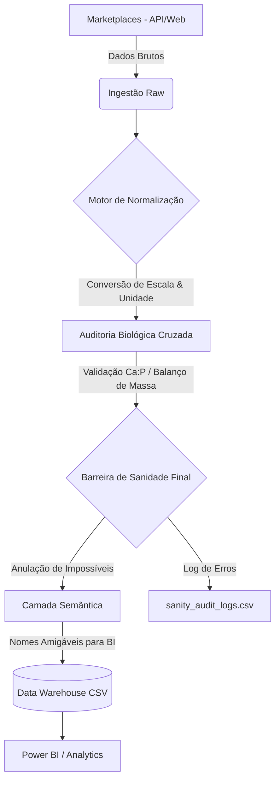

# Dog Food Nutrition Catalog & Price Tracker 🐕🥗💰

Este projeto é um pipeline automatizado de Engenharia de Dados focado na extração, normalização e análise de produtos de alimentação canina. Ele coleta dados de múltiplos marketplaces (Cobasi, Petlove), extrai informações nutricionais via web crawling e gera um Data Warehouse local em formato CSV, otimizado para visualização em ferramentas de BI como Power BI.

## 🚀 Fluxo de Dados

O pipeline opera em um ciclo de vida refinado, garantindo que o dado bruto seja transformado em informação de negócio confiável:



## 🌟 Funcionalidades Principais

- **Extração Híbrida Multi-Fonte:** Coleta metadados e preços via API VTEX (Cobasi) e Web Crawling (Petlove).
- **Motor de Normalização Avançado:** 
    - Resolve automaticamente disparidades de unidades (%, g/kg, mg/kg, UI/kg, kcal/kg).
    - Corrige erros sistemáticos de escala (10x, 100x) através de heurísticas de plausibilidade.
    - Mantém rastreabilidade completa (`original_value` vs `normalized_value`).
- **Auditoria Biológica de Precisão:**
    - **Balanço de Massa:** Verifica se a soma de macronutrientes (Proteína, Gordura, Fibra, Cinzas e Umidade) está na faixa biológica (**600-1050 g/kg**), considerando a presença de Carboidratos (NFE) em rações secas.
    - **Razão Ca:P:** Valida a relação essencial entre Cálcio e Fósforo (1:1 a 2:1).
    - **Contexto de Categoria:** Flexibiliza automaticamente limites para Petiscos e Suplementos (até 3x o teto padrão).
    - **Energia Metabolizável:** Validação determinística baseada em unidades e faixas físicas (500-4500 kcal/kg).
- **Data Warehouse Star Schema:**
    - **`dim_product`**: Cadastro limpo de produtos com atributos de Porte, Idade, Tier e Proteína.
    - **`fact_nutrient`**: Perfil nutricional detalhado no formato LONG para análises granulares.
    - **`fact_price_snapshot`**: Histórico temporal de preços por SKU/Embalagem.
- **Power BI Ready:** Dados exportados com Camada Semântica (nomes amigáveis) e codificação UTF-8-SIG para compatibilidade imediata.

## 📁 Estrutura do Projeto

```text
├── app/
│   ├── collectors/    # Ingestão de dados (Cobasi, Petlove)
│   ├── normalization/ # Motor de normalização e auditoria biológica
│   ├── parsers/       # Extração de dados via Regex e HTML
│   ├── semantic/      # Classificação e enriquecimento semântico
│   └── warehouse/     # Modelagem Star Schema e exportação
├── data/
│   └── output/        # Arquivos CSV finais (Warehouse)
├── docs/              # Relatórios técnicos e documentação
└── executar_pipeline.py # Ponto de entrada principal
```

## 🛠️ Como Executar

1.  **Instale as dependências:**
    ```bash
    pip install -r app/requirements.txt
    ```

2.  **Execute o pipeline completo:**
    ```bash
    python executar_pipeline.py --mode full
    ```

3.  **Execute apenas atualização de preços:**
    ```bash
    python executar_pipeline.py --mode price
    ```

## 📖 Documentação Adicional

Para detalhes sobre as regras de negócio e histórico de melhorias:
- [**Relatório Técnico Consolidado**](docs/RELATORIO_TECNICO_CONSOLIDADO.md)

---
Desenvolvido para análise técnica e estratégica do mercado pet.
