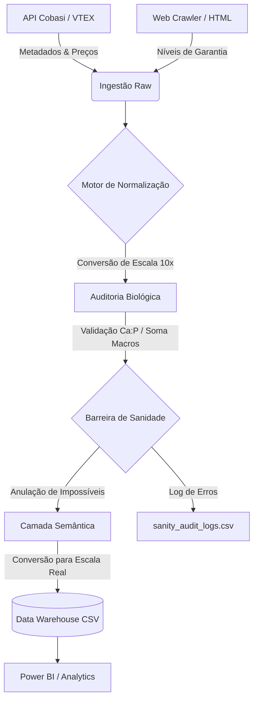

# Dog Food Nutrition Catalog & Price Tracker 🐕🥗💰

Este projeto é um pipeline automatizado de Engenharia de Dados focado na extração, normalização e análise de produtos de alimentação canina. Ele coleta dados da API da Cobasi, extrai informações nutricionais via web crawling e gera um Data Warehouse local em formato CSV, otimizado para visualização em ferramentas de BI como Power BI.

## 🚀 Mapa de Fluxo do Pipeline

O pipeline opera em um ciclo de vida de 5 estágios, garantindo que o dado bruto seja refinado até se tornar uma informação de negócio confiável:



## 🚀 Funcionalidades Principais

- **Extração Híbrida:** Combina requisições de API VTEX para metadados de produtos com Web Crawling para extração de Níveis de Garantia.
- **Motor de Normalização Inteligente:** Converte automaticamente unidades disparates (%, g/kg, mg/kg) para unidades canônicas, resolvendo ambiguidades biológicas e corrigindo erros de escala comuns (10x, 100x).
- **Auditoria Biológica Avançada (v1.4.x):** Implementa validações cruzadas rigorosas para garantir a integridade dos dados:
    - **Soma de Macronutrientes:** Validação de densidade nutricional total.
    - **Razão Cálcio:Fósforo (Ca:P):** Faixa biológica ajustada (0.9 a 4.5).
    - **Âncora de Umidade:** Correção automática de energia em dietas úmidas.
    - **Densidade de Sódio:** Detecção de erros de escala via correlação com proteína.
- **Robustez de Coleta:** Mecanismo de **Retry Inteligente** com backoff exponencial para lidar com instabilidades de API.
- **Power BI Ready:** Exportação em formato regional brasileiro (R$) e modelagem Star Schema.
- **Inteligência Semântica:** Classificação automática de Porte, Idade, Tier e Fonte de Proteína.
- **Captura Multi-SKU de Preços:** Coleta detalhada de preços para todas as variações de embalagem/tamanho de um produto, incluindo preço por kg, preço de lista e preço de assinante.

## 📁 Estrutura do Projeto

```text
├── app/
│   ├── collectors/    # Módulos de extração (API e Crawler)
│   ├── normalization/ # Motor de conversão e validação nutricional
│   ├── parsers/       # Extração de dados via Regex e HTML
│   ├── semantic/      # Classificação e enriquecimento semântico
│   └── warehouse/     # Lógica de persistência e exportação incremental
├── data/
│   └── output/        # Pasta dedicada para arquivos CSV finais (Warehouse)
├── docs/              # Documentação técnica e relatórios consolidados
└── executar_pipeline.py # Ponto de entrada do projeto
```

## 📖 Documentação Técnica

Para detalhes aprofundados sobre a arquitetura, histórico de correções e esquema de dados, consulte o relatório consolidado:
- [**Relatório Técnico Consolidado**](docs/RELATORIO_TECNICO_CONSOLIDADO.md)


## 🛠️ Como Executar os Testes (Pré-Pull Request)

Para garantir que as novas funcionalidades de multiloja e integração com a Petlove não quebraram o projeto, execute o script unificado:

```bash
./run_pre_pr_tests.sh
```

Este script executará:
1.  **Integração Petlove**: Valida a extração de SKUs e EANs da Petlove.
2.  **Multi-variação de Preço**: Valida se o warehouse suporta múltiplas embalagens por produto.
3.  **Warehouse Core**: Executa os testes existentes do projeto para garantir que não houve regressão.

## 🛠️ Como Executar

1.  **Instale as dependências:**
    ```bash
    pip install -r app/requirements.txt
    ```

2.  **Execute o pipeline:**
    ```bash
    python executar_pipeline.py --mode full
    ```
    *Use `--mode full` para garantir a limpeza completa e reprocessamento de todos os dados, ativando todas as novas validações e correções.*

    Para atualizar apenas os preços (mais rápido):
    ```bash
    python executar_pipeline.py --mode price
    ```

3.  **Verifique os resultados:**
    Os arquivos serão gerados na pasta `/output/warehouse`:
    - `dim_product.csv`: Cadastro de produtos (1 linha por produto).
    - `fact_nutrient.csv`: Histórico de níveis nutricionais (1 linha por nutriente/produto/dia).
    - `fact_price_snapshot.csv`: Histórico de preços detalhado (1 linha por SKU/produto/dia).

## 📊 Modelagem de Dados

O projeto segue os princípios de Data Warehousing, com um modelo Star Schema otimizado para Power BI:

| Tabela | Chave Primária (PK) | Chave Estrangeira (FK) | Granularidade |
|---|---|---|---|
| **`dim_product`** | `product_id` | - | 1 linha por Produto |
| **`fact_nutrient`** | - | `product_id` | 1 linha por Nutriente/Produto/Dia |
| **`fact_price_snapshot`** | - | `product_id` | 1 linha por SKU/Produto/Dia |

**Relacionamentos no Power BI:**
- `dim_product` (PK: `product_id`) relaciona-se com `fact_nutrient` (FK: `product_id`) em uma relação 1 para N.
- `dim_product` (PK: `product_id`) relaciona-se com `fact_price_snapshot` (FK: `product_id`) em uma relação 1 para N.

O `sku_id`, `sku_name` e `package_weight_kg` em `fact_price_snapshot` permitem análises detalhadas por variação de embalagem, enquanto `product_id` mantém a integridade referencial com a dimensão principal.

## 🔧 Tecnologias Utilizadas

- **Python 3.11+**
- **Pandas:** Manipulação e análise de dados.
- **Httpx:** Requisições assíncronas e robustas.
- **BeautifulSoup4:** Parsing de HTML para crawling.
- **Regex:** Extração precisa de padrões nutricionais.

---
Desenvolvido para fins de consultoria e análise de mercado pet.
