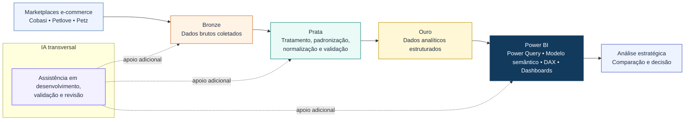

# Dog Food Nutrition Catalog

Este repositório reúne uma solução de engenharia de dados para coleta, normalização, validação e exportação de informações nutricionais e comerciais de alimentos para cães. O projeto foi organizado para apoiar análise estratégica, rastreabilidade e preparação de dados para BI.

## Visão geral

A solução combina:
- ingestão de dados de marketplaces;
- extração e padronização de atributos nutricionais;
- validação de plausibilidade biológica e semântica;
- exportação para um modelo warehouse em formato tabular, pronto para uso em ferramentas analíticas.

## Estado atual do projeto

### O que está consolidado
- fluxo principal de execução e processamento do pipeline;
- normalização de unidades e validação nutricional;
- exportação estruturada para dados de produto, nutrientes e preços;
- documentação técnica e relatórios de auditoria.

### O que está limitado
- a coleta ativa de preços da Petlove e da Petz não está validada como fluxo operacional estável;
- os bloqueios observados são externos às regras internas do projeto e exigem acesso autorizado ou fontes alternativas.

> Observação: este repositório está em trabalho na branch `feat/coleta-precos-petlove-petz`, portanto parte da estrutura atual ainda reflete mudanças em progresso.

## Arquitetura do fluxo

A solução foi estruturada para transformar dados heterogêneos de marketplaces em informações confiáveis, analíticas e prontas para decisão de negócio. O fluxo segue a lógica de camada de valor do dado: bruto, tratado e analítico.


```mermaid
flowchart LR
    A[Marketplaces e-commerce<br/>Cobasi • Petlove • Petz] --> B[Bronze<br/>Dados brutos coletados]
    B --> C[Prata<br/>Tratamento, padronização,<br/>normalização e validação]
    C --> D[Ouro<br/>Dados analíticos estruturados]
    D --> E[Power BI<br/>Power Query • Modelo semântico • DAX • Dashboards]
    E --> F[Análise estratégica<br/>Comparação e decisão]

    subgraph IA[IA transversal]
        I[Assistência em desenvolvimento,<br/>validação e revisão]
    end

    I -. apoio adicional .-> B
    I -. apoio adicional .-> C
    I -. apoio adicional .-> E

    classDef bronze fill:#fff3e6,stroke:#d98f52,color:#1e2e42,stroke-width:1.5px;
    classDef silver fill:#eafaf6,stroke:#3b9c90,color:#1e2e42,stroke-width:1.5px;
    classDef gold fill:#fff7d6,stroke:#c9a72a,color:#1e2e42,stroke-width:1.5px;
    classDef bi fill:#123a5d,stroke:#123a5d,color:#ffffff,stroke-width:1.5px;
    classDef source fill:#eef4ff,stroke:#6a8fc0,color:#1e2e42,stroke-width:1.5px;
    classDef decision fill:#edf3ff,stroke:#6478d5,color:#1e2e42,stroke-width:1.5px;
    classDef ia fill:#f3f0ff,stroke:#7a6ef3,color:#1e2e42,stroke-width:1.5px;

    class A source;
    class B bronze;
    class C silver;
    class D gold;
    class E bi;
    class F decision;
    class I ia;
```

### Interpretação executiva
- Bronze representa o dado bruto e heterogêneo, ainda em forma de coleta e ingestão original.
- Prata representa o dado confiável, tratado, padronizado, normalizado e submetido a validações de plausibilidade e qualidade.
- Ouro representa o dado analítico, já estruturado para consumo e decisão.
- Power BI consolida esse valor em modelos semânticos, cálculos DAX e dashboards de análise e comparação.
- A IA atua como apoio transversal ao desenvolvimento, validação e revisão, e não como etapa automática do pipeline.

## Estrutura do repositório

```text
app/                 # módulos principais do pipeline
  collectors/        # coletores por marketplace
  core/              # configuração, logging e utilidades
  normalization/     # regras e validação nutricional
  parsers/           # extração e parsing de dados
  pipeline/          # orquestração e relatórios
  semantic/          # enriquecimento semântico
  services/          # serviços de execução e integração
config/              # configuração YAML do pipeline
data/                # dados intermediários e de saída
output/              # relatórios e exports
scripts/             # scripts de execução e validação
docs/                # documentação técnica e análise
  docs/reports/      # relatórios e análises em Markdown
  docs/pbi/          # relatórios Power BI (.pbix)
tests/               # testes unitários e de regressão
```

## Execução rápida

### 1. Instalar dependências

```bash
pip install -r app/requirements.txt
```

### 2. Executar o pipeline completo

```bash
python scripts/executar_pipeline.py --mode full
```

### 3. Executar com marketplaces específicos

```bash
python scripts/executar_pipeline.py --marketplaces Cobasi
```

## Documentação principal

- [docs/README.md](docs/README.md) — índice da documentação do projeto.
- [docs/RELATORIO_TECNICO_CONSOLIDADO.md](docs/RELATORIO_TECNICO_CONSOLIDADO.md) — visão técnica consolidada.
- [docs/reports/RELATORIO_REGRAS_NORMALIZACAO.md](docs/reports/RELATORIO_REGRAS_NORMALIZACAO.md) — regras de normalização e auditoria.
- [docs/reports/ANALISE_COLETA_PRECOS_PETLOVE_PETZ.md](docs/reports/ANALISE_COLETA_PRECOS_PETLOVE_PETZ.md) — análise das limitações de coleta.

## Validação recente

Os testes executados recentemente foram:
- `pytest -q tests/test_petlove_petz_collectors.py` → 2 passed
- `pytest -q tests/test_pipeline.py` → 12 passed

## Diretrizes de manutenção

- manter a documentação alinhada com o estado real da implementação;
- preferir mudanças com evidência operacional e testes;
- documentar limitações e bloqueios de forma explícita;
- manter a branch principal como referência da versão consolidada.

---
Projeto estruturado para evolução controlada, rastreabilidade e confiabilidade técnica.
