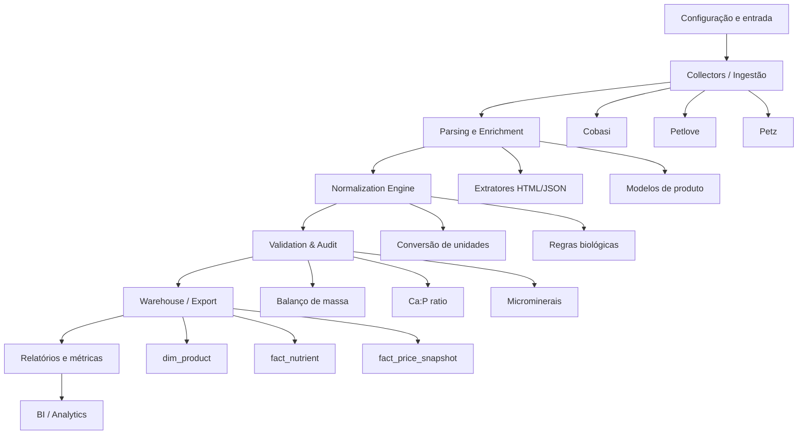

# Dog Food Nutrition Catalog

Este repositório reúne uma solução de engenharia de dados para coleta, normalização, validação e exportação de informações nutricionais e comerciais de alimentos para cães. O projeto foi organizado para apoiar análise estratégica, rastreabilidade e preparação de dados para BI.

## Visão geral

A solução combina:
- ingestão de dados de marketplaces;
- extração e padronização de atributos nutricionais;
- validação de plausibilidade biológica e semântica;
- exportação para um modelo warehouse em formato tabular, pronto para uso em ferramentas analíticas.

## Estado atual do projeto

### O que está consolidado
- fluxo principal de execução e processamento do pipeline;
- normalização de unidades e validação nutricional;
- exportação estruturada para dados de produto, nutrientes e preços;
- documentação técnica e relatórios de auditoria.

### O que está limitado
- a coleta ativa de preços da Petlove e da Petz não está validada como fluxo operacional estável;
- os bloqueios observados são externos às regras internas do projeto e exigem acesso autorizado ou fontes alternativas.

> Observação: este repositório está em trabalho na branch `feat/coleta-precos-petlove-petz`, portanto parte da estrutura atual ainda reflete mudanças em progresso.

## Arquitetura do fluxo


```mermaid
flowchart TD
    A[Configuração e entrada] --> B[Collectors / Ingestão]
    B --> C[Parsing e Enrichment]
    C --> D[Normalization Engine]
    D --> E[Validation & Audit]
    E --> F[Warehouse / Export]
    F --> G[Relatórios e métricas]
    G --> H[BI / Analytics]

    B --> B1[Cobasi]
    B --> B2[Petlove]
    B --> B3[Petz]

    C --> C1[Extratores HTML/JSON]
    C --> C2[Modelos de produto]

    D --> D1[Conversão de unidades]
    D --> D2[Regras biológicas]

    E --> E1[Balanço de massa]
    E --> E2[Ca:P ratio]
    E --> E3[Microminerais]

    F --> F1[dim_product]
    F --> F2[fact_nutrient]
    F --> F3[fact_price_snapshot]
```

## Estrutura do repositório

```text
app/                 # módulos principais do pipeline
  collectors/        # coletores por marketplace
  core/              # configuração, logging e utilidades
  normalization/     # regras e validação nutricional
  parsers/           # extração e parsing de dados
  pipeline/          # orquestração e relatórios
  semantic/          # enriquecimento semântico
  services/          # serviços de execução e integração
config/              # configuração YAML do pipeline
data/                # dados intermediários e de saída
output/              # relatórios e exports
scripts/             # scripts de execução e validação
docs/                # documentação técnica e análise
  docs/reports/      # relatórios e análises em Markdown
  docs/pbi/          # relatórios Power BI (.pbix)
tests/               # testes unitários e de regressão
```

## Execução rápida

### 1. Instalar dependências

```bash
pip install -r app/requirements.txt
```

### 2. Executar o pipeline completo

```bash
python scripts/executar_pipeline.py --mode full
```

### 3. Executar com marketplaces específicos

```bash
python scripts/executar_pipeline.py --marketplaces Cobasi
```

## Documentação principal

- [docs/README.md](docs/README.md) — índice da documentação do projeto.
- [docs/RELATORIO_TECNICO_CONSOLIDADO.md](docs/RELATORIO_TECNICO_CONSOLIDADO.md) — visão técnica consolidada.
- [docs/reports/RELATORIO_REGRAS_NORMALIZACAO.md](docs/reports/RELATORIO_REGRAS_NORMALIZACAO.md) — regras de normalização e auditoria.
- [docs/reports/ANALISE_COLETA_PRECOS_PETLOVE_PETZ.md](docs/reports/ANALISE_COLETA_PRECOS_PETLOVE_PETZ.md) — análise das limitações de coleta.

## Validação recente

Os testes executados recentemente foram:
- `pytest -q tests/test_petlove_petz_collectors.py` → 2 passed
- `pytest -q tests/test_pipeline.py` → 12 passed

## Diretrizes de manutenção

- manter a documentação alinhada com o estado real da implementação;
- preferir mudanças com evidência operacional e testes;
- documentar limitações e bloqueios de forma explícita;
- manter a branch principal como referência da versão consolidada.

---
Projeto estruturado para evolução controlada, rastreabilidade e confiabilidade técnica.
