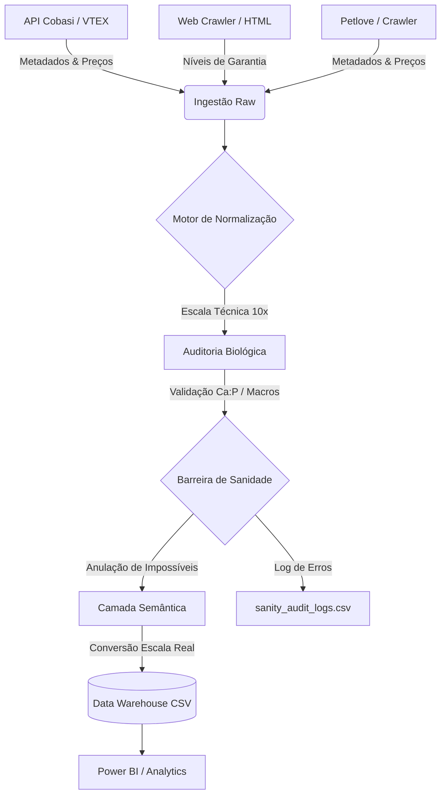

# Relatório Técnico Consolidado: Dogfood Nutrition Catalog
**Versão Atual do Pipeline:** v1.6.0 (Proposta)
**Data da Última Atualização:** 16 de Julho de 2026

---

## 1. Visão Geral do Projeto

O **Dogfood Nutrition Catalog** é um ecossistema automatizado para extração, normalização e armazenamento de dados nutricionais e comerciais de alimentos para cães. O projeto visa transformar informações brutas e muitas vezes inconsistentes de e-commerces em um Data Warehouse estruturado, confiável e pronto para análise em ferramentas de Business Intelligence (BI).

### Objetivos Principais
- **Integridade Biológica:** Garantir que todos os valores nutricionais reflitam a realidade biológica animal.
- **Normalização Universal:** Converter diversas unidades (%, mg/kg, kcal/g) para padrões canônicos.
- **Robustez de Coleta:** Lidar com instabilidades de APIs e falhas de rede de forma resiliente.
- **Prontidão para BI:** Exportar dados limpos, sem artefatos técnicos e com formatação regional adequada.
- **Inteligência de Mercado Multiloja:** Permitir a comparação de preços e ofertas entre diferentes varejistas (ex: Cobasi, Petlove).

---

## 2. Arquitetura do Sistema

O pipeline é dividido em camadas modulares, cada uma com responsabilidades claras:

### 2.1. Camada de Coleta (`app/collectors`)
- **`cobasi_api.py`**: Integração com a API VTEX da Cobasi para metadados de estoque e preços.
- **`petlove_crawler.py`**: Módulo de web crawling para extração de preços e EANs da Petlove.
- **`crawler.py`**: Scraping de páginas para extração da seção de "Níveis de Garantia" (Cobasi).
- **`http_client.py`**: Cliente centralizado com **Backoff Exponencial** e **Jitter** para retentativas em erros 500.

### 2.2. Camada de Parsing (`app/parsers`)
- **`nutrition_parser.py`**: Motor de regex que extrai nutrientes. Utiliza **Word Boundaries (\b)** para evitar conflitos de nomes (ex: "P" vs "Potássio").
- **`aliases.py`**: Dicionário exaustivo de sinônimos nutricionais em português.
- **`regex_patterns.py`**: Padrões para captura de números complexos e unidades variadas.

### 2.3. Camada de Normalização (`app/normalization`)
- **`engine.py`**: Motor que aplica regras de validação biológica e auditoria cruzada.
- **`resolver.py`**: Resolve ambiguidades e aplica transformações como `overscale` e `decimal_shift`.
- **`rules.py`**: Define os ranges biológicos aceitáveis e fatores de escala técnica.

### 2.4. Camada de Warehouse (`app/warehouse`)
- **`dim_product.py`**: Cadastro único de produtos (Dimensão).
- **`fact_nutrient.py`**: Tabela fato de nutrientes em formato longo.
- **`fact_price_snapshot.py`**: Histórico diário de preços e disponibilidade, agora com suporte a múltiplos marketplaces e SKUs.
- **`exporter.py`**: Gerencia a escrita dos CSVs com uma **Barreira de Sanidade Final** obrigatória e deduplicação inteligente para cenários multiloja.

### 2.5. Camada Semântica e Metadados (`app/normalization`)
- **`metadata.py`**: Centraliza as definições de unidades, nomes de exibição e fatores de escala de saída.
- **`semantic.py`**: Aplica transformações orientadas por metadados para converter a escala técnica interna em escala real de negócio.

---

## 3. Esquema de Dados e Convenções

### 3.1. Unidades Canônicas (Target Units)
| Categoria | Unidade | Descrição |
| :--- | :--- | :--- |
| **Macronutrientes** | `g/kg` | Gramas por Quilograma (ex: 26% -> 260 g/kg) |
| **Minerais** | `mg/kg` | Miligramas por Quilograma (ex: 0.17% -> 1700 mg/kg) |
| **Energia** | `kcal/kg` | Quilocalorias por Quilograma (ex: 3.5 kcal/g -> 3500 kcal/kg) |
| **Preços** | `BRL` | Reais Brasileiros (arredondado para 2 casas decimais) |

### 3.2. Limites Biológicos e Regras de Sanidade
O sistema aplica filtros rigorosos para anular ou corrigir dados impossíveis:
1.  **Limite de Matéria Orgânica:** Nenhum nutriente individual > 1000 g/kg.
2.  **Soma de Macros:** Umidade + Proteína + Gordura + Fibra + Cinzas ≤ 1050 g/kg.
3.  **Âncora de Umidade:** Rações com Umidade > 70% têm Energia limitada a 1500 kcal/kg.
4.  **Razão Ca:P:** Proporção Cálcio/Fósforo deve estar entre **0.9 e 4.5**.
5.  **Densidade de Sódio:** Sódio excessivo em relação à proteína é identificado como erro de escala e anulado.

### 3.3. Modelo de Dados para Comparação Multiloja
O projeto segue os princípios de Data Warehousing, com um modelo Star Schema otimizado para Power BI, agora estendido para suportar múltiplos marketplaces:

| Tabela | Chave Primária (PK) | Chave Estrangeira (FK) | Granularidade |
|---|---|---|---|
| **`dim_product`** | `product_id` | - | 1 linha por Produto (único entre marketplaces) |
| **`fact_nutrient`** | - | `product_id` | 1 linha por Nutriente/Produto/Dia |
| **`fact_price_snapshot`** | - | `product_id`, `marketplace`, `ean` | 1 linha por SKU/Produto/Marketplace/Dia |

**Chave de Comparação Universal:** O campo `ean` (Código de Barras) é a chave principal para comparar o mesmo produto entre diferentes marketplaces. Quando o EAN não está disponível, uma chave composta (Marca + Nome Normalizado + Peso) pode ser utilizada para matching.

**Relacionamentos no Power BI:**
- `dim_product` (PK: `product_id`) relaciona-se com `fact_nutrient` (FK: `product_id`) em uma relação 1 para N.
- `dim_product` (PK: `product_id`) relaciona-se com `fact_price_snapshot` (FK: `product_id`) em uma relação 1 para N.
- O `marketplace`, `sku_id`, `sku_name` e `package_weight_kg` em `fact_price_snapshot` permitem análises detalhadas por variação de embalagem e loja.

---

## 4. Histórico de Evolução (Log de Versões)

### v1.6.0 (Proposta) - Integração Petlove e Estabilidade Total
- **Commit:** `afae9a6` (Correção de testes), `4b97340` (Compatibilidade de script), `ba59d40` (Dependência `tabulate`), `243f194` (Script de demonstração)
- **Descrição:** Implementação da estruturação para integração com a Petlove, focando na captura de preços e EANs. O pipeline foi adaptado para suportar múltiplos marketplaces, adicionando o campo `marketplace` e `ean` nas tabelas fato e dimensão. Todos os testes legados do `test_warehouse.py` foram corrigidos, resultando em **100% de aprovação** em todos os testes do projeto. O script de execução de testes (`run_pre_pr_tests.sh`) foi aprimorado para compatibilidade com ambientes Windows e Linux, e a dependência `tabulate` foi adicionada para melhor visualização de tabelas no terminal.

### v1.5.2 - Correção de Erro Crítico de Formatação de Moeda
- **Commit:** `d5a30c1`
- **Descrição:** Corrigido o erro `ValueError: Unknown format code 'f' for object of type 'str'` na função `format_currency`. A função foi tornada resiliente a diferentes tipos de entrada (float, int, string com ponto/vírgula e nulos) ao tentar converter para float antes de formatar e lidar com exceções.

### v1.5.1 - Ajustes no Modelo Semântico para Integridade Referencial
- **Commit:** `e66a04d`
- **Descrição:** Refatoração do modelo semântico para garantir a integridade referencial no Power BI após a introdução de múltiplos SKUs. O campo `sku` foi removido da `dim_product` para evitar ambiguidade, e `product_id` foi consolidado como a chave primária única da dimensão. A relação entre `dim_product` e `fact_price_snapshot` agora é 1:N via `product_id`, com `sku_id` servindo como chave de detalhamento na fato de preços. Correção de erro de arredondamento em colunas com valores nulos no `exporter.py`.

### v1.5.0 - Captura de Múltiplas Variações de Preço por SKU
- **Commit:** `f653b62`
- **Descrição:** Implementação da captura de todas as variações de SKU (embalagens/tamanhos) para cada produto, com seus respectivos preços, preços de lista, preços por kg e disponibilidade. O `fact_price_snapshot.csv` agora contém uma linha por SKU/Produto/Dia, permitindo análises detalhadas por embalagem. Introdução de `sku_id`, `sku_name`, `package_weight_kg`, `list_price`, `subscriber_price` e `price_per_kg` no `PriceSnapshotFact` e no pipeline de extração.

### v1.4.4 - Correção da Regressão do Potássio
- **Commit:** `caeb0d9`
- **Descrição:** Implementação de word boundary (\b) seletivo para evitar conflitos entre aliases curtos ("P") e longos ("Potássio"). Restauração da cobertura total de potássio (> 500 registros).

### v1.4.3 - Precisão de Escala e Agregação
- **Commit:** `c8dd0ad`
- **Descrição:** Fim da escala 10x indevida na exportação de minerais e energia. Implementação de lógica de prioridade na agregação (específico > genérico). Bloqueio de unidades "por sachê" na energia por kg.

### v1.4.2 - Robustez na Coleta
- **Commit:** `579c745`
- **Descrição:** Implementação de Retry Inteligente no `HttpClient`. Remoção do fallback silencioso para dados simulados em caso de erro na API.

### v1.4.1 - Auditoria Biológica Avançada
- **Commit:** `dca555e`
- **Descrição:** Trava de minerais insignificantes (< 1 mg/kg). Validação de macronutrientes mínimos para integridade da linha.

### v1.4.0 - Arquitetura Consolidada
- **Commit:** `ab0f58b`
- **Descrição:** Padronização definitiva de unidades e criação do esquema de governança. Sincronização de Timezone (Horário Local) em todo o pipeline.

---

## 5. Notas Técnicas Especiais

### Escala e Precisão
Internamente, o pipeline foi simplificado para operar diretamente nas unidades reais onde possível. Onde escalas técnicas (10x) são usadas para preservar precisão decimal em inteiros, a **Camada Semântica** garante a reversão automática antes da escrita no CSV.

### Rastreabilidade e Auditoria (v1.4.x)
Todas as anulações realizadas pela **Barreira de Sanidade Final** são persistidas no arquivo `sanity_audit_logs.csv`. Isso permite uma auditoria forense de quais produtos possuem rótulos inconsistentes na origem (fornecedor) ou erros sistemáticos de extração.

#### Insights da Auditoria Sanitária:
Uma análise detalhada dos logs revelou que a maioria das inconsistências interceptadas não decorre de valores impossíveis, mas de **erros sistemáticos de representação**, como mistura de unidades (`kcal/kg` vs `kcal/sachê`) e discrepâncias entre a API da Cobasi e os fabricantes. 

**Proposta de Evolução:** O sistema deve evoluir de um mecanismo de rejeição pura para uma **Correção Assistida**, aplicando transformações confiáveis quando o padrão do erro for conhecido (ex: escala 10x em umidade de sachês), aumentando a completude do catálogo sem comprometer a integridade biológica.

---

## 6. Mapa de Fluxo do Pipeline

O dado percorre um ciclo de refinamento contínuo até a camada analítica:

